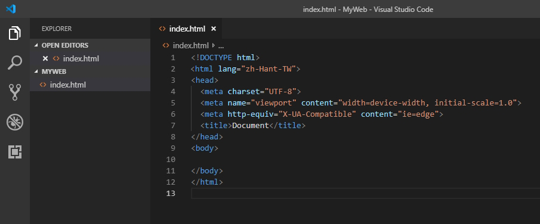
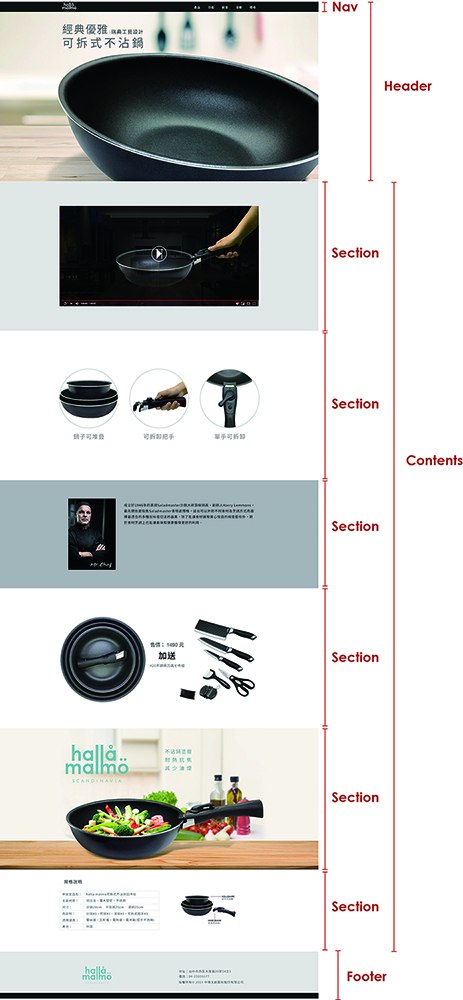
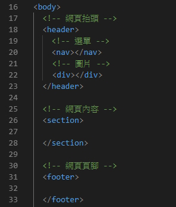

# Bootstrap 網頁框架佈局

先建立網頁骨架，從Photoshop 設計好網頁版型後，建立HTML網頁框架，包含header、 nav 、section、 contents、footer。

使用編輯器開啟一個空白的頁面，並設定好HTML應有的標準內容

> 編輯器有 [VScode](https://code.visualstudio.com/)、[Atom](https://atom.io)、[Brackets](http://brackets.io/)、[Sublime](https://www.sublimetext.com/) 請自行選擇上手的。



將Photoshop 設計好的網頁版型，做網頁框架佈局，按照網頁版型，切分成 網頁骨架 header、 nav 、section、 contents、footer。



```markup
<!-- 網頁抬頭 -->
<header>
  <!-- 選單 -->
  <nav></nav>
  <!-- 圖片 -->
  <div></div>
</header> 
<!-- 網頁內容 -->
<section></section> 
<!-- 網頁頁腳 -->
<footer></footer>
```



