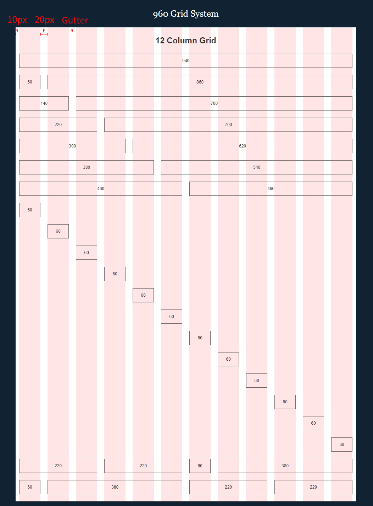
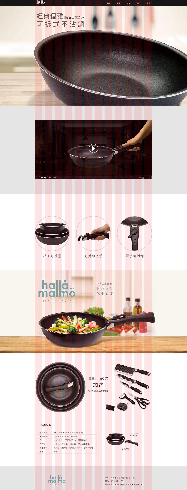
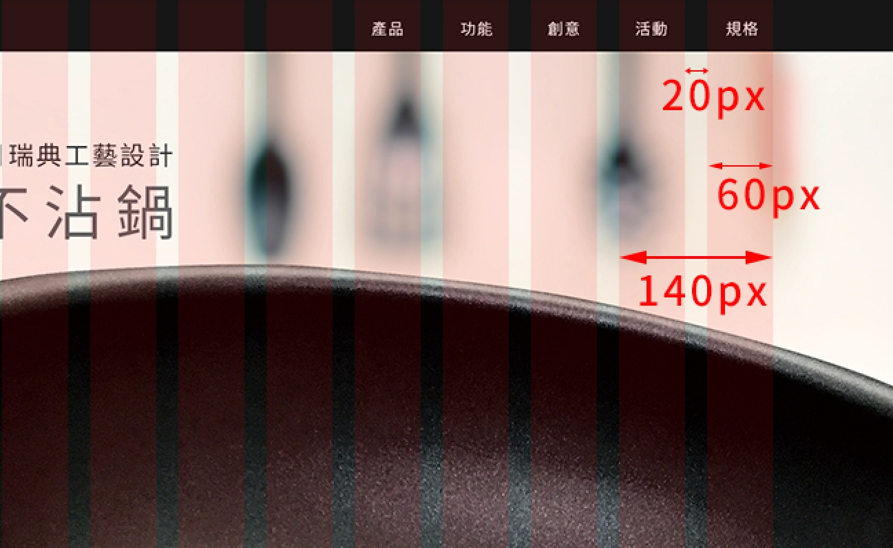

# Bootstrap 4 Grid System

美國設計教父 Paul Rand \(保羅・蘭德\)對網格系統下過定義：

> #### 網格的概念是，他給你一套層級系統，但同時也給你豐富的多樣性，網格完全沒變，變的永遠是網格裡面的東西，就是這點讓事情變得活潑有趣。

[960 Grid System](http://960.gs/)，是由Nathan Smith開發的CSS框架，因為早期的電腦螢幕寬度約為 1024，扣除瀏覽器的捲軸及邊框，為960px， 960 Grid System有12欄位、16欄位版本，960 正是意味著，12能被3、4、6整除，能建立3欄、4欄、6欄的版面配置，網頁的使用也比較靈活。

 960 Grid System是使用固定寬度960 pixel，置中對齊畫面的方式呈現在網頁上，去除左右兩邊各10 pixel的空間\(margin\)，留下中間 940 pixel的區塊以20 pixel 作為間隔\(Gutter\)分欄。

網頁版面可以輕鬆配置，合併，也不會有畸零數，非常適合DIV排版。

如下圖，一個欄\(Column\)的寬度是 60px，但兩個欄位數的寬度不是 120px，需要加上兩者之間的欄位間隔\(Gutter\)，所以數值會是 60 + 60 + 20 = 140px。

