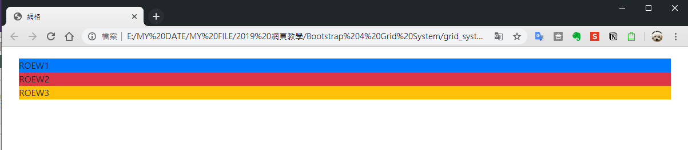

# Row

### Row 水平群組

Row行是欄的水平群組，使用Row 讓每個欄位都能確保都在同一行，所以當我們建立了網頁的最外框架Containers後，就一定要在裡面建立Row水平群組，_**這樣才不會跑版**_。

可以試看看在Containers中建立三個row

```markup
 <div class="container">
        <div class="row bg-primary">test1</div>
        <div class="row bg-danger">test2</div>
        <div class="row bg-warning">test3</div>
 </div>
```



