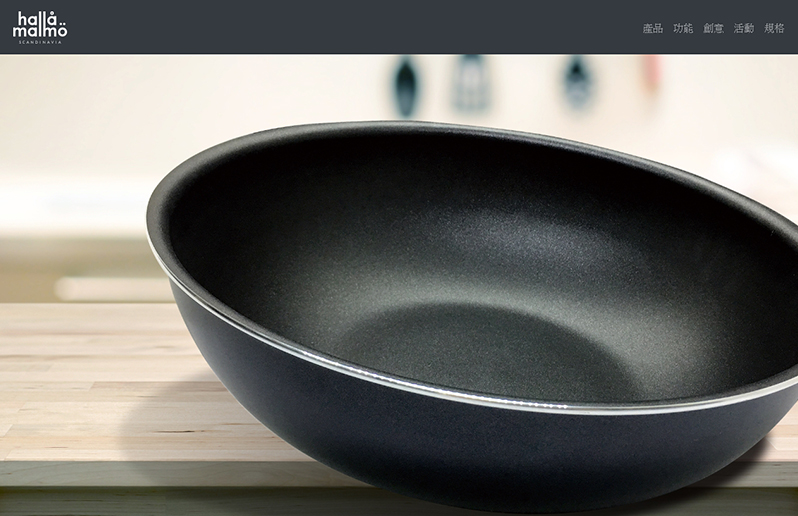
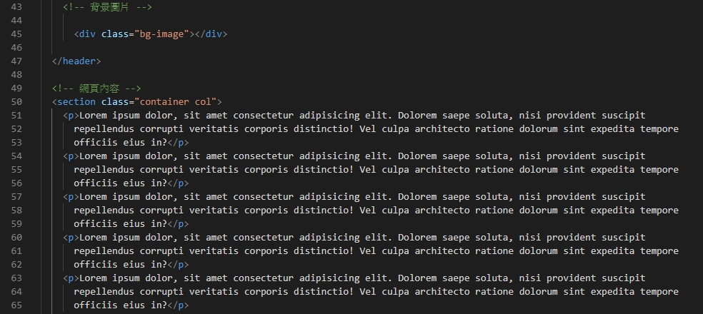
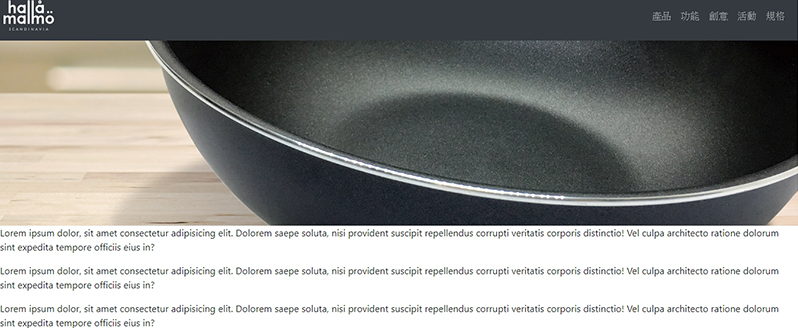
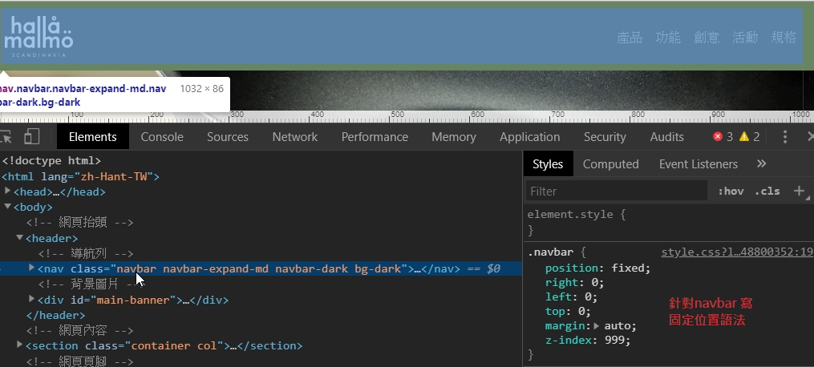

# header背景圖片

我們要製作Header裡面的Banner，因為我們的Banner是要填滿背景，上方要押抬頭標題，所以請先將背景圖片準備好。

```markup
<div class="bg-image"></div>
```

輸入div，並設定其class 名稱`bg-image(可自行定義)`和屬性，在CSS中把圖片叫進來。

```css
.bg-image {
  background-image: url(images/banner.jpg);  /*自己的電腦圖片資料夾位置*/
  position: absolute;  /*絕對位置*/
  left: 0;
  right: 0;
  top: 0;
  bottom: 0;
  background-position: center;
  background-size: cover;
  z-index: -999; /*設定圖片層級*/
}
```



為了測試背景效果，我們在下方`<section> </section>`中輸入一些假字，撐起網頁。




當然，我們不希望下方網頁內容將背景全部蓋住，所以希望假字可以在背景之下。所以要給背景圖片一個高度，讓圖片撐起頁面，也將假字往下推。

並希望下方背景在滑鼠往下瀏覽頁面時，背景圖可以固定在原本的位置不動，所以接著，設定圖片符合螢幕高度100%。給圖片加入一個ID名稱`main-banner` ，並包住背景圖片div。

```markup
   <div class="bg-image bg-parallax"></div>
 </div>
```

```css
#main-banner {
  height: 100vh;  /*vh是view height，指螢幕可視範圍高度的百分比*/
}
.bg-parallax {
  background-attachment: fixed;
}
```



一頁式網頁，會一直往下瀏覽，但我們不希望導覽列選單會因為我們網頁往下滑，而必須回頭來找選單，所以記得選單要設定讓它在網頁往下滑時，固定在表頭，這樣就算滑到最下面也可以很容易在螢幕範圍內點擊選單到我們要的資訊頁面。



```css
.navbar {
  position: fixed;
  right: 0;
  left: 0;
  top: 0;
  margin: auto;
  z-index: 999;
}
```

