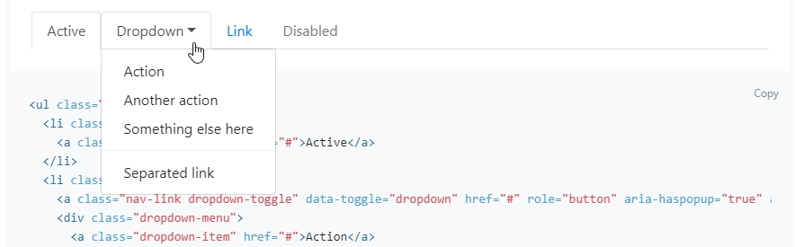
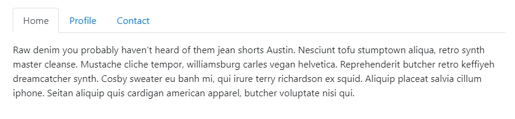
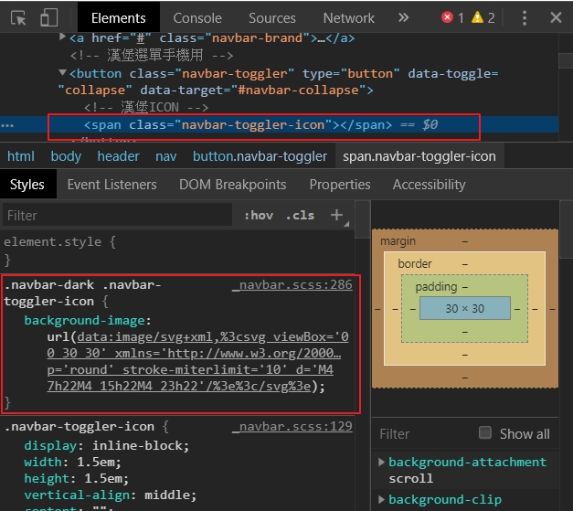

# 選單導航列

開始製作網頁選單Nav這個部分，由於Nav是包在Header裡面，所以要先寫`<header></header>`，並把`<nav></nav>`包在面，&lt;nav&gt;要設定class，來設定風格。

`navbar`為Bootstrap的內建選單，Bootstrap已經將CSS語法都寫在裡面了，所以我們就輸入名稱，把選單的風格呼叫進來，`navbar-dark`為深色選單，`bg-dark`為黑色背景，如下圖。


### \`\`[Bootstrap的內建選單](https://bootstrap.hexschool.com/docs/4.2/components/navbar/)


### 置入LOGO

> 建立LOGO，將準備好的LOGO圖片置入HTML中

```markup
 <a href="#" class="navbar-brand">
   
 </a>
```


### 建立選單List

> 利用ul、li 建立選單

```markup
<div>
  <ul>
    <li><a href="#">產品</a></li>
    <li><a href="#">功能</a></li>
    <li><a href="#">創意</a></li>
    <li><a href="#">活動</a></li>
    <li><a href="#">規格</a></li>
  </ul>
</div>
```

產生如下圖的 List

```markup
<nav class="navber navbar-dark bg-dark">
```


> 將Bootstrap 標籤套入HTML

緊接著要再套入Bootstrap 的css，讓文字變漂亮。**`<ul>`**加入**`class="navbar-nav"`** ，**`<li>`**加入**`class="navbar-item"`**如下圖示。

```markup
<nav class="navbar navbar-dark bg-dark">

      <!-- LOGO -->
      <a href="#" class="navbar-brand">
        
      </a>
      <!-- 選單內容 -->
      <div>
        <ul class="navbar-nav">
          <li><a href="#" class="nav-link">產品</a></li>
          <li><a href="#" class="nav-link">功能</a></li>
          <li><a href="#" class="nav-link">創意</a></li>
          <li><a href="#" class="nav-link">活動</a></li>
          <li><a href="#" class="nav-link">規格</a></li>
        </ul>
      </div>

    </nav>
```


由於，選單為直式排列，不是我們要的，要將選單由直向排列，改成橫向排列，在`<nav class>`中加入 `navbar-expand-md` ，讓網頁_大於_ _768px_ 就會變成橫向排列，_小於768px_就會變成直向排列。

```markup
<nav class="navbar navbar-dark bg-dark navbar-expand-md">
```


加入 **`<div class="container">  </div>`** 包住NAV導覽列，讓導覽列左右兩邊出現空間


### 建立手機用選單按鈕

> 加入手機用漢堡選單

```markup
<button class="navbar-toggler"></button>
```


```markup
 <button class="navbar-toggler" type="button" data-toggle="collapse">
```

* **`navbar-toggler` 就是一個告訴選單要做切換的動作**
* **`button`**告訴瀏覽器 type類型是**`button`**按鈕類型
* **`data-toggle`**是指事件觸發，JavaScript用的，**`data-toggle`**後面指定觸發的形式要怎麼顯示，有可能是tab\(頁籤\)、dropdown\(下拉\)形式，我們目前網頁用**`collapse`**\(摺疊\)形式。
* **`data-target`** 定義你的按鈕要對應的對象，ID名稱自己設定。






設定好漢堡選單類型後，要再加入漢堡ICON，讓摺疊選單可以顯示出來


```markup
 <span class="navbar-toggler-icon"></span>
```



可以從使用者開發工具中看到，Bootstrap 都已經將**`navbar-toggler-icon`**向量ICON寫好在專屬的navbar.css裡面了，這樣我們就可以少寫很多繁瑣的CSS語法。有了ICON自然手機漢堡選單圖示就會出現了。

> 讓漢堡選單和下拉內容做串聯

兩個不同的東西要做互動，必須要給他ID名稱，讓彼此可以有交集，所以我們就幫下拉選單設定一個ID名稱，**ID要用\#開頭**，名稱自訂，自訂完，記得要給漢堡按鈕也放進相同ID。


